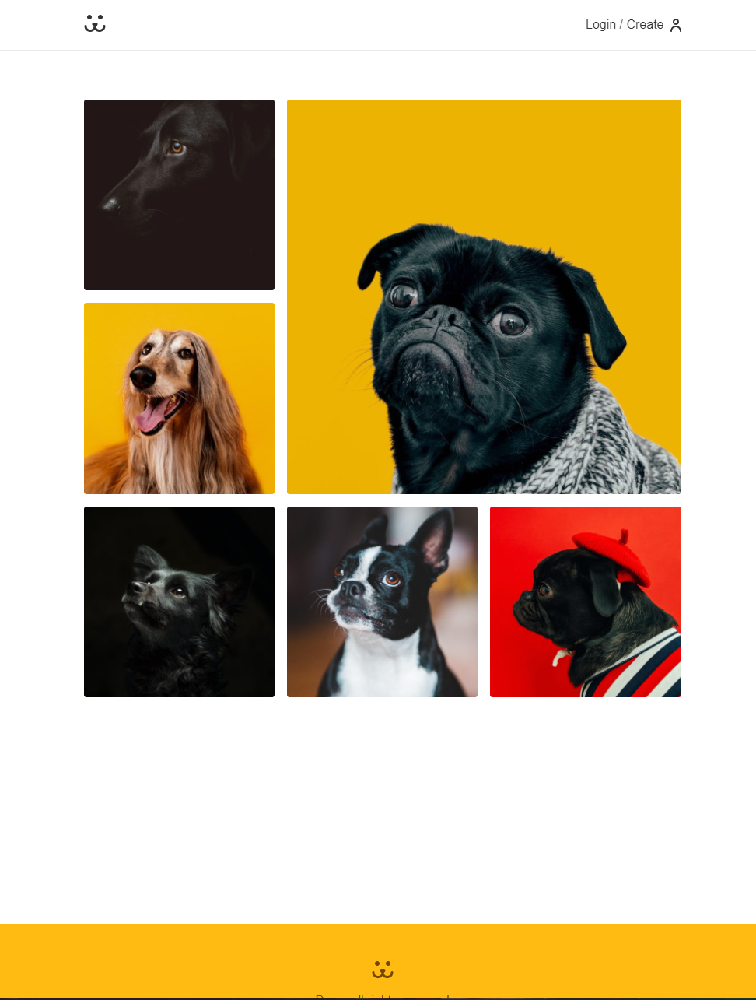
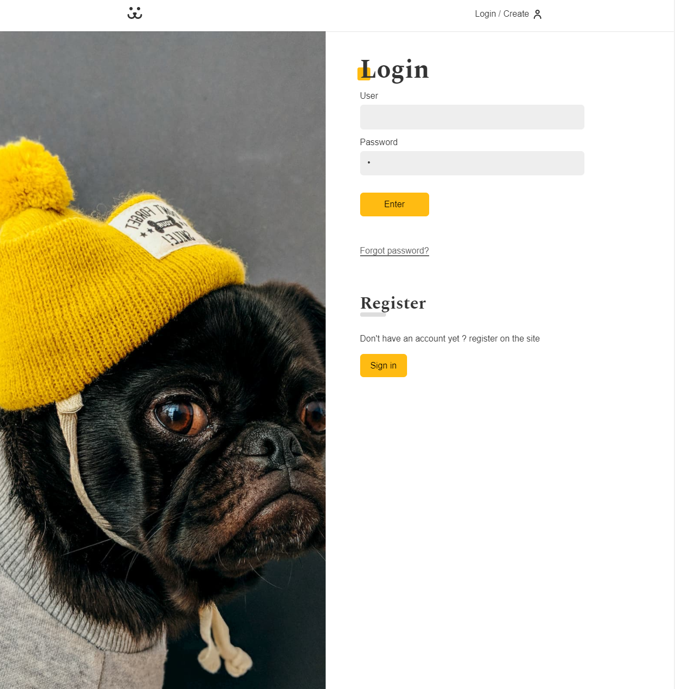
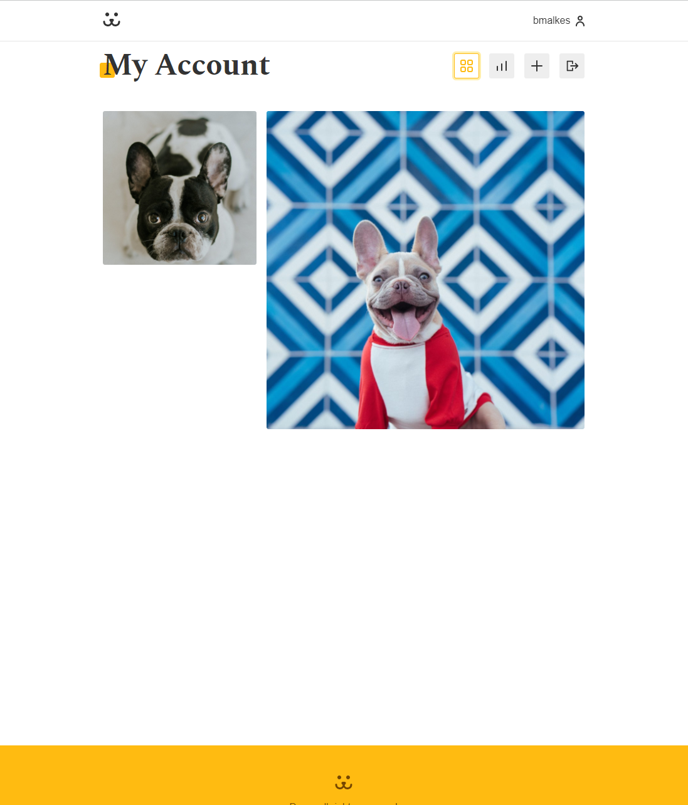

# Dogs is a project create with React App

For check online project <a href="https://dogs-app1.herokuapp.com/">https://dogs-app1.herokuapp.com/</a>

This project was used React useEffect, useState, useMemo, Components, Forms, React-Router, Params & UseContext.

